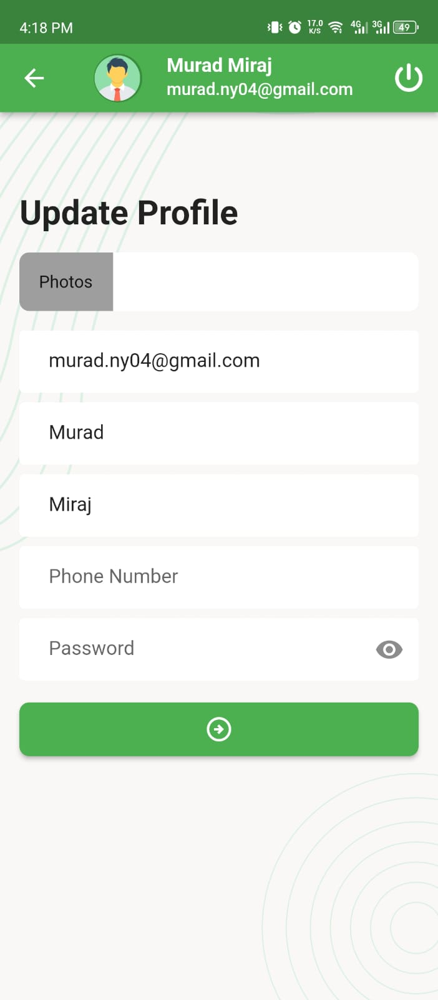

# Task_manager_flutter

A new Task Manager Flutter project.

**_In this Apps, i use fvm. flutter version 3.10.6. kindly check the fvm config file_**

To get this app, run this command in your terminal:

```bash

## Remember to run fvm command to get the flutter version 3.10.6

```bash
fvm use 3.10.6
flutter pub get
```

## Problems

here are some problems

- The update image is not showing in the appbar.
- Reset password is working also previous password is working.(There is some bugs in the api, **the
  Response is success and OTP is successfully get the email**)
- The Status count api is not working. *
  *_So i have to use different method to get the status count. and its working fine.__*

## _Here are some screenshot of the app_

 Auth                                                     | table                                                    |
----------------------------------------------------------|----------------------------------------------------------
  | 
  | 
  | 
 🗈 **_New task screen_**                                 | 🗈 **_Add New task screen_**                             |
  | 
 **_Update Profile screen_**                              | **_Complete task screen_**                               |
  | 
  | 
 **_status change Buttom sheet_**                         | **_log out warning popup_**                              |
  | 
 
# Task_Manager_App
